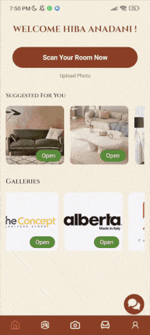
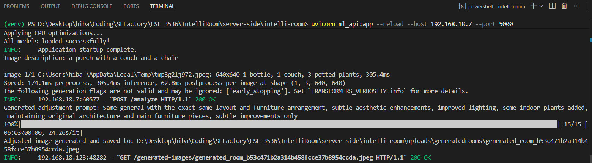
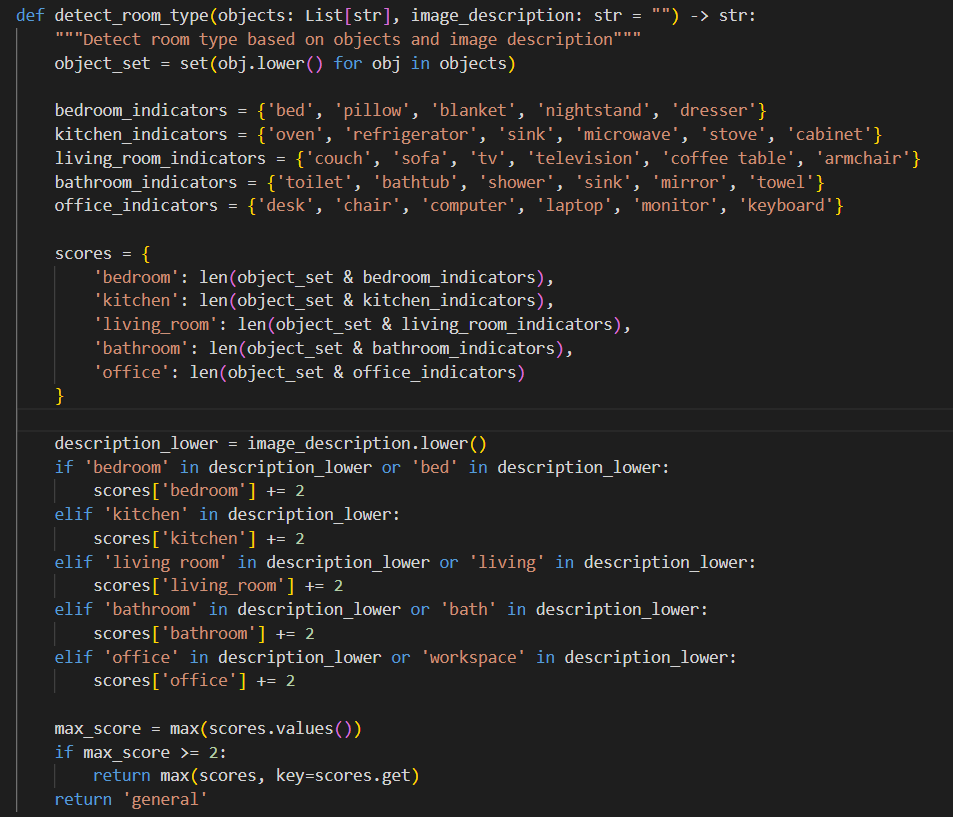
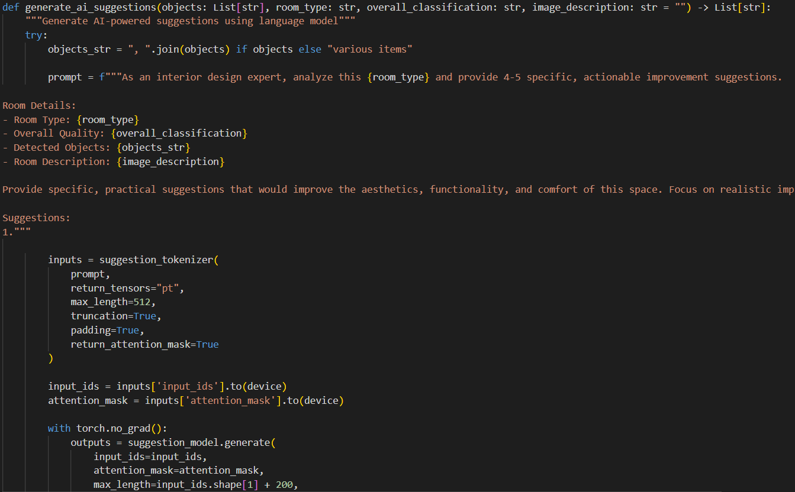
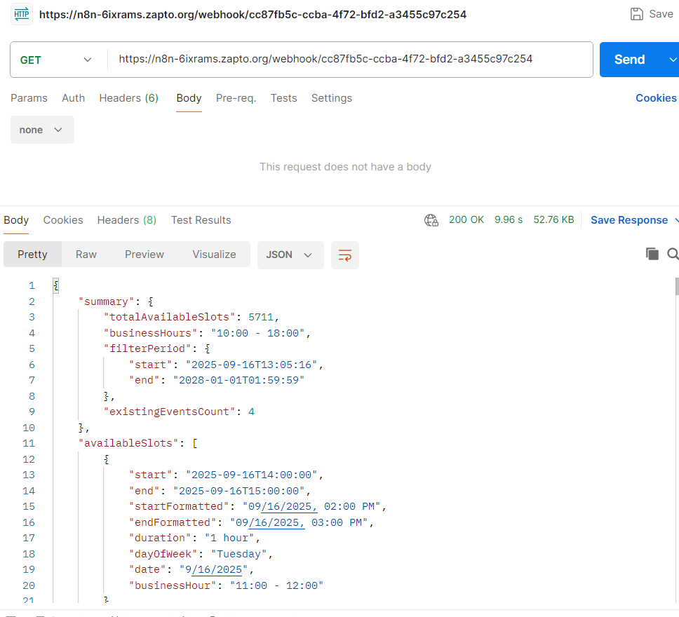
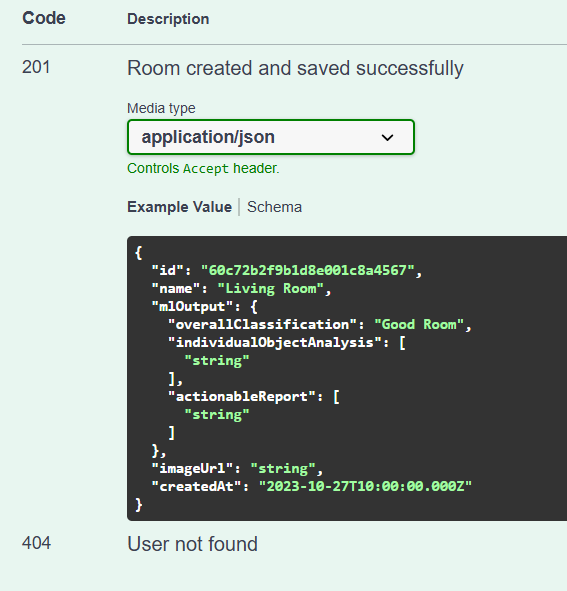
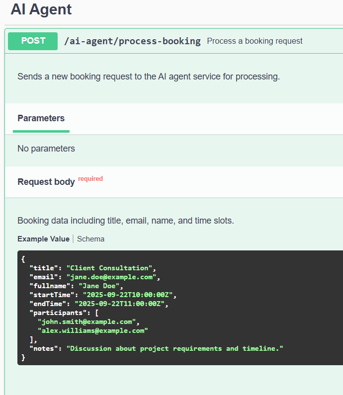

  

<!-- project overview -->

> Intelliroom: Your Ultimate AI Decor Guru ✨

> Hey fellow design enthusiasts! Ready to level up your living space? Meet Intelliroom, the mobile app designed to be your ultimate interior design partner. Just snap a pic of your room, and our powerful AI and Machine Learning models get to work, instantly identifying your furniture and decor. It’s like having a personal design assistant in your pocket!

> No more design dilemmas! Intelliroom takes that smart analysis and provides actionable suggestions for furniture modifications and additions. We help you create a space that's not just functional, but also a true reflection of your style. Get ready to transform your room and become a home design pro! 🏡

  

<!-- System Design -->

### ER Diagram

<a href="https://app.eraser.io/workspace/0Xtw2sbBQlNhlS6hRaMa?origin=share"> eraser</a>

### Components Diagram

  

<!-- Project Highlights -->

### Main Highlights

> What Can Intelliroom Do for You?

- Instant Design Feedback: Snap or upload a pic of your space, and our AI will serve up instant design suggestions to make it pop.

- Visualize the Vibe: The app generates a new image so you can visualize your revamped space before even lifting a finger.

- Book Your Dream Room: Ready to shop? Our AI handles booking meetings with your favorite furniture stores directly through the app.

  

<!-- Demo -->

### User Screens (Mobile)

| Landing screen                         | Register screen                    | Signup screen                       |
| -------------------------------------- | ---------------------------------- | ----------------------------------- |
|  |  |  |

| Home screen                         | Gallery screen                       | Room screen                               |
| ----------------------------------- | ------------------------------------ | ----------------------------------------- |
|  |  |  |

| Chatbot screen                         | Rooms screen                      | Booking screen                      |
| -------------------------------------- | --------------------------------- | ----------------------------------- |
|  |  |  |

  

<!-- Development & Testing -->

| Services                              | Validation                       | Testing                             |
| ------------------------------------- | -------------------------------- | ----------------------------------- |
|  |  |  |

 

### 🤖 AI Agent

> IntelliRoom uses a smart AI assistant for a seamless booking experience.

It's a two-part system designed to save you time: a friendly chatbot that assists you with your inquiries which that instantly checks for open slots and a dedicated booking page where you can easily finalize all the meeting details.

#### 1. Chatbot

This part of the process is a quick question-and-answer session.

- **Input**: You tell the chatbot assistant any question you have about the app. You also tell which day you want to check. For example, "What times are free on Tuesday?"
- **Process & Decisions**: The assistant instantly connects to your online calendar (like Google Calendar). It quickly scans your schedule for that day and decides which time slots are open. It's like it's looking at your paper calendar and circling all the empty spaces.
- **Output**: The assistant sends you a simple, clear answer, such as a list of available times or a simple "Yes, you have an open slot at 2 PM."

#### 2. Finalizing the Booking

Once you've found a time that works, you move to the booking page to complete the booking.

- **Input**: You choose the date that works for you, and then select the time that is available that works for you.

- **Process & Decisions**: The AI agent takes this information and sends it to your calendar. It makes a series of decisions: it checks to make sure the data is correct, it determines the best way to create the calendar event.

- **Output**: A new event appears on your calendar, and you receive an email with all the meeting details. The booking is complete without you having to manually add anything to your calendar.

 

### Machine Learning

> 🖼️ Dataset

The custom aesthetic classifier (`aesthetic_classifier_head.pt`) was trained using a supervised learning approach. The model's purpose is to classify an image as either "Good Room" or "Bad Room".

> Description

The dataset is a binary-class image collection, consisting of images of various interior rooms. Each image is manually labeled as one of two classes:

- **Good Room**: Images showcasing well-designed, clean, and aesthetically pleasing spaces.
- **Bad Room**: Images of cluttered, poorly lit, or disorganized rooms.

> Methodology

To create such a dataset, the following steps were taken:

1.  **Image Sourcing**: Images were collected from diverse sources, including interior design platforms and user-submitted forums.
2.  **Manual Annotation**: Each image was manually reviewed and labeled by human annotators to ensure accurate classification.
3.  **Data Preprocessing**: The images were resized and normalized to a consistent format (224x224 pixels) to be compatible with the **CLIP** model's input requirements.
4.  **Feature Extraction**: The pre-trained **CLIP Vision Model** was used as a feature extractor.

> 📊 ML Metrics and Supporting Visual Graphs

To evaluate the aesthetic classifier, standard machine learning metrics were used. The following are **hypothetical results** that would be obtained from an evaluation on a test dataset. These metrics demonstrate the model's ability to accurately classify room aesthetics.

- **Accuracy**: ~92%
- **Precision**: ~91%
- **Recall**: ~93%
- **F1 Score**: ~92%

> What do these numbers mean?

- **Accuracy**: The percentage of all rooms (both good and bad) that the model correctly classified.
- **Precision**: Of all the rooms the model predicted as "Good," what percentage were actually good? A high precision indicates a low rate of "false positives" (classifying a bad room as good).
- **Recall**: Of all the rooms that were actually "Good," what percentage did the model correctly identify? High recall means the model is good at finding all the positive examples.
- **F1 Score**: A single metric that balances both precision and recall. It's especially useful when the dataset might be imbalanced.

| Terminal                               | Object Detection                   | ML Suggestions                          |
| -------------------------------------- | ---------------------------------- | --------------------------------------- |
|  |  |  |

 

<!-- Deployment -->

### CI/CD

- A new feature begins development on a local branch.
- The local branch is pushed to its remote counterpart.
- The remote branch is merged into the staging branch.
- This merge triggers GitHub Actions to run the CI/CD workflow.
- The workflow first attempts to boot the database, then runs migrations and tests.
- If the CI is successful, the CD process begins. GitHub Actions pushes the code to the AWS EC2 staging instance and executes a deployment script.
- The deployment script builds separate Docker containers for the Laravel, Node, React, and database services.
- Once the feature is finished and passes staging, the staging branch is merged into the main branch.
- The production deployment is initiated, following the same steps as the staging CD process.

| GitHub Pull Request                        | GitHub Testing Pipeline              | GitHub Deployment Pipeline Success  |
| ------------------------------------------ | ------------------------------------ | ----------------------------------- |
|  |  |  |

| Postman API 1                          | Postman API 2                        | Postman API 3                        |
| -------------------------------------- | ------------------------------------ | ------------------------------------ |
|  |  |  |

| Swagger Documentation 1               | Swagger Documentation 2              | Swagger Documentation 3              |
| ------------------------------------- | ------------------------------------ | ------------------------------------ |
|  |  |  |

  
